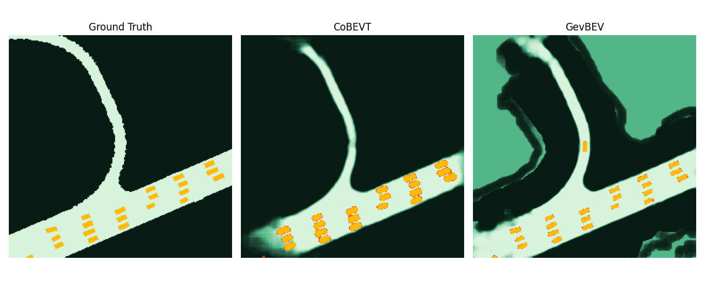
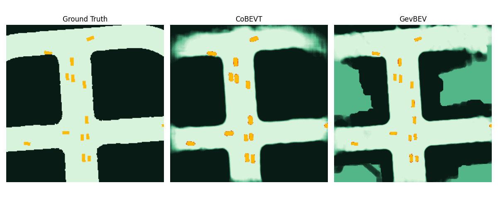

# GevBEV: Generating Evidential BEV Maps in Continuous Driving Space
[](https://arxiv.org/abs/2302.02928)
[](https://seafile.cloud.uni-hannover.de/d/3f40932f3bc14cdeb1e6/)
### Demo: BEV map view segmentation on OPV2V dataset
__Road Confidence: 1-0__\

\


## Datasets
### OPV2V

Download our [augmented OPV2V dataset](https://seafile.cloud.uni-hannover.de/d/c88d1cc85e7e4cae929f/) for lidar-based BEV map segmentation. 
It is generated by replaying the scenarios of the [official OPV2V dataset](https://mobility-lab.seas.ucla.edu/opv2v/) and includes both ground truth BEV maps and 
class labels for each lidar point. 
Since the lidar intensity simulated by CARLA doesn't reflect the
real world situation, we replace the intensity column with the class labels. 
As a result, our lidar files are in binary format with attributes of 
[x, y, z, label] for each row.

After downloading, unzip with 
```shell
cat train.part.* > train.zip
cat test.part.* > test.zip
unzip train.zip
unzip test.zip
```
The unzipped files should have the following structure:
```shell
├── opv2v
│   ├── train
|      |── 2021_08_16_22_26_54
|      |── ...
│   ├── test
```
### V2V4Real
Please check the official [website](https://research.seas.ucla.edu/mobility-lab/v2v4real/) to download the V2V4Real dataset (OPV2V format).
The unzipped files should have the following structure:
```shell
├── v2v4real
│   ├── train
|      |── testoutput_CAV_data_2022-03-15-09-54-40_1
│   ├── validate
│   ├── test
```

## Installation
### Requirement
- Pytorch >= 1.8
- CUDA >= 10.2
- Python >= 3.6

Our model is tested on Ubuntu 18.04/20.04 with CUDA 11.3. 
Please run the following command to set up the conda environment with replacing ```$ENV_NAME``` and ```$CONDA_PATH``` 
with your desired environment name and your installation path of conda.
The defaults are ```$ENV_NAME=gevbev```, ```$CONDA_PATH=~/anaconda3/etc/profile.d/conda.sh```.
```shell
cd GevBEV
bash setup.sh --env_name $ENV_NAME --conda_path $CONDA_PATH
```
If have other OS and CUDA versions and failed on setting up the environment with our script, please try to install with the following steps.
1. Create the conda environment and install essential packages. Replace ```$ENV_NAME``` with the name you want.
```shell
conda create -n $ENV_NAME python=3.8 
conda activate $ENV_NAME
conda install openblas-devel -c anaconda -y
sudo apt install build-essential python3-dev libopenblas-dev -y
pip install --upgrade pip
```
2. Install pytorch essentials. Please install your desired version with the instructions of the pytorch official site.
We take torch 1.12 and CUDA 11.3 as an example:
```shell
pip install torch==1.12.1+cu113 torchvision==0.13.1+cu113 torchaudio==0.12.1 \
--extra-index-url https://download.pytorch.org/whl/cu113
```
3. Install MinkowskiEngine. For CUDA=11.x, install with the following command.
For other versions, please follow their [documentation](https://github.com/NVIDIA/MinkowskiEngine#anaconda).
```shell
pip install -U git+https://github.com/NVIDIA/MinkowskiEngine -v --no-deps \
    --global-option="--blas_include_dirs=${CONDA_PREFIX}/include" \
    --global-option="--blas=openblas"
```
4. Compile the torch extensions.
```shell
cd ops && pip install . && cd ..
```

5. Install required python packages.
```shell
pip install -r requirements.txt
```

6. Test the installation.
```shell
sh -c '
TORCH="$(python -c "import torch; print(torch.__version__)")"
export OMP_NUM_THREADS=16
ME="$(python  -W ignore -c "import MinkowskiEngine as ME; print(ME.__version__)")"

echo "[INFO] Finished the installation!"
echo "[INFO] ========== Configurations =========="
echo "[INFO] PyTorch version: $TORCH"
echo "[INFO] MinkowskiEngine version: $ME"
'
```

## Get started
### Train
```shell
# in the root path of GevBEV
PATHONPATH=. python tools/train.py --config (filename) [--cuda_loader] [--resume] [--log_dir (logdir)] \
[--run_name (name)] [--seed (seed)] [--debug]
```
args:
- ```config```: (required) config file name, i.e. ```./config/minkunet_evigausbev_oopv2v.yaml```. 
__Please adapte the data path in this file before running__
- ```cuda_loader```: (optional) accelerate data loading with cuda if set.
- ```resume```: (optional) whether to resume the training, ```--log_dir``` should also be set if ```---resume``` is set
- ```log_dir```: (optional) log path for the training output.
- ```run_name```: (optional) name for log_dir prefix of an experiment.
- ```seed```: (optional) random seeds.
- ```debug```: (optional) set debug will output the more logging debug infos.

### Test
```shell
# in the root path of GevBEV
PATHONPATH=. python tools/test.py --log_dir (logdir) [--cuda_loader]\
[--run_name (name)] [--save_img]
```
args:
- ```cuda_loader```: (optional) accelerate data loading with cuda if set.
- ```log_dir```: (optional) log path for the training output folder.
- ```save_img```: (optional) output visulization images if set.

### Benchmark models
Your can find the code and the checkpoints of the trained model under the repo [v2v4real-bevseg](https://github.com/YuanYunshuang/v2v4real-bevseg).
In this repo, you can generate bev segmentation result with the following command. Please check the repo for more details.
```shell
# in the root path of v2v4real-bevseg
python opencood/tools/inference.py --model_dir ${CHECKPOINT_FOLDER} --fusion_method ${FUSION_STRATEGY} [--show_vis] [--show_sequence] [--save_evibev]
```

## Results and Checkpoints

| Method    | OPV2V-road | OPV2V-object | V2V4Real-object | OPV2V ckpt                                                                                                                            | V2V4Real ckpt |
|-----------|------------|--------------|-----------------|---------------------------------------------------------------------------------------------------------------------------------------|---------------|
| BEV       | 72.5       | 74.1         | 45.1            | [](https://seafile.cloud.uni-hannover.de/d/8a692d3547f54bd6874b/) | [](https://seafile.cloud.uni-hannover.de/d/49666a2aa1d64f90a8e8/) |
| EviBEV    | 75.0       | 75.3         | 44.5            | [](https://seafile.cloud.uni-hannover.de/d/6458864c0a3f478081dc/) | [](https://seafile.cloud.uni-hannover.de/d/1a9d65d7e93b4e548528/) |
| GevBEV    | 79.5       | 74.7         | 46.3            | [](https://seafile.cloud.uni-hannover.de/d/a3db03b570554fa2adbc/) | [](https://seafile.cloud.uni-hannover.de/d/8acad8d3c6954ea8b825/) |


## Citation
```
@article{Yuan_gevbev2023,
  title={Generating Evidential BEV Maps in Continuous Driving Space},
  author={Yunshuang Yuan and Hao Cheng and Michael Ying Yang and Monika Sester},
  journal={ISPRS Journal of Photogrammetry and Remote Sensing},
  volume = {204},
  pages = {27-41},
  year = {2023},
  issn = {0924-2716},
  doi = {https://doi.org/10.1016/j.isprsjprs.2023.08.013},
  url = {https://www.sciencedirect.com/science/article/pii/S0924271623002290},
}
```

